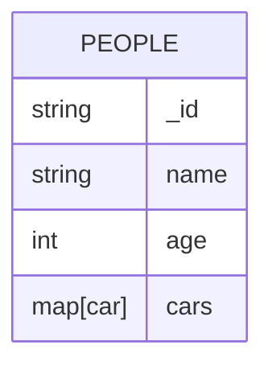
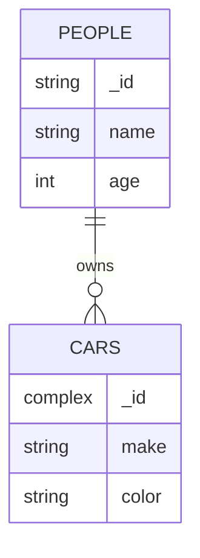

import Tabs from '@theme/Tabs';
import TabItem from '@theme/TabItem';
import SnippetGroup from '@site/src/components/SnippetGroup';

This section provides guidance about how to model your data inside Ditto's collection and document schemaless database.


## Creating relationships

Ditto does not support nesting documents or collections. If you need to create relationships
between documents, use a foreign key relationship by referencing the `_id` of
the document.

### ⚠️ Bad pattern: Big documents

Documents should not be larger than 250Kb. Any document that is larger than 5MB
will not synchronize to other peers. Ditto over Bluetooth LE typically
synchronizes documents at a maximum speed of 20 kB/second. This means that a
single document that is 250kb large could take 10 seconds (in the best case
scenario) to synchronize for the first time between devices.

Ditto breaks a document into chunks, synchronize those parts over the mesh, and
then reconstructs the document on the other side. Once the document has been
reconstructed, it will be returned from the callback and can be rendered in the
UI. This means that a user would see a loading spinner for 10 seconds. 




```jsonc
{
  "name": "Susan",
  "cars": {
      "abc123": {
        "make": "Hyundai",
        "color": "red"
      },
      "def456": {
        "make": "Jeep",
        "color": "pink"
      }
      ...
}
```


### 👍 Good pattern: Flat models

Ditto syncs and queries documents based on a combination of the collection name and the document `_id`.
Collections are a way to create an index to a set of related documents. You can
create foreign relationships between documents by referencing the `_id`. For
example, you may have an `orders` collection and a `customers` collection.



In the above example, each car is owned by a person. We represent this by using
the `_id.owner` field to relate to the person's `_id`. 

When Susan gets a car, you can create a new document in the `cars` collection
with the foreign key relationship to the `people` collection.

In the `people` collection:
```jsonc
{
  "_id": "abc123",
  "name": "Susan",
  "age": 31
}
```

In the `cars` collection.
```jsonc
{
  "_id": {
    "orderId": "def456",
    "owner": "abc123" 
  },
  "make": "Hyundai",
  "color": "red",
}
```

:::info
Remember, `_id` is immutable, so only use this pattern when you are
dealing with static identifiers within your foreign key relationship. 
:::

#### Using a Write Transaction 

When inserting a new car and a person at the same time, we want to use a a write
transaction. This allows a device to perform atomic transactions across
collections within a single database call. This means that both documents will be synchronized
at the same time to other devices. 

In our above example, this ensures that a peer will always see the person
document for Susan if they have received the Hyundai document.

<SnippetGroup name="write-transaction" />

For more information about write transactions, see the section on [Writing -> Batching](./writing#batching-multiple-updates-in-a-single-transaction).

## Using properties to define behavior

There are situations where you want to show a document in a view only for some circumstances.
In these cases, we recommend that the model have a boolean property that 
determines if the received data should be shown in the UI. 

```swift
// Document content

let note = ["text": text, "firstClassOnly": false]

if !note.firstClassOnly {
    // Show it on UI
}
```

## Versioning

Ditto's replication protocol is backwards-compatible and reliable. This means
that eventually you will have the *"couch device problem"* (i.e., a device that
fell behind a couch). In other words, a device in your mesh may be offline for a
significant amount of time before connecting back with other devices. 

If the shape of your documents are significantly different on that device, there
could be documents that do not conform with your new application code.
Synchronizing with this "couch device" could cause other devices to crash
unexpectedly in production if precautions aren't taken in your application
schema.

### When do I version my documents?

Changing your schema is inevitable. To ensure reliability over time, you
should create your own schema versioning pattern for each Ditto document.

### Same-version compatibility

Some applications do not need backward- or forward- compatibility, which can
simplify their business logic significantly.  If that sounds like your
application, we recommend that you use a pattern where you change the name of
the collection for each schema version of your application. This enforces
further that field types never change. For example, you can use
`myCollection_v{number}` as a convention to specify the collection schema
version your app will be listening to. When a schema change is necessary, bump
the number. Collections are very cheap to create in Ditto, so this will scale
even for applications that run for many years. 

You could also only synchronize documents that come from schema versions
that are the same as your current schema version.  

```js
const query = 'name == $args.name && age <= $args.age && _schemaVersion == 1'
collection.find(query, () => {
  age: 32,
  name: 'Max',
})
```

### Forward-compatibility

In a typical centralized database like PostgreSQL, developers often focus on
backward-compatbility, where newer versions of the application can open old
documents. In a distributed system, you do not have central control of all
modifications to data. In an offline peer-to-peer mesh, it is difficult and
sometimes impossible to control all versions of your application that are active
in production environments. Because of these constraints, you need to not only
think of backward-compatibility, but also forward-compatibility.

An application is forward-compatible when existing code is able to read new
data. We can see [forward-compatibility in web development](https://developer.mozilla.org/en-US/docs/Web/Guide/Writing_forward-compatible_websites).

To achieve forward-compatibility of your database, you should never change
the type of an existing field. In other words, developers should only ever add
new fields, and never remove or modify old fields. You can ensure this by
creating a controller that encapsulates Ditto and is used across your
application(s) to validate the field values and their associated types before
upserting those values into the database.

### Backward-compatibility

Older data could be very important, or it could not be. It's your choice to
decide what to do with these old documents: you could accept (as-is), reject
(ignore), or migrate them to the new schema.

For example, here's a breaking version change where we add a new field and
change the type of an old field:

**App version 2**

```swift
private struct V1Car {
    let _id: String
    let make: String
    let model: String
    let year: String
    var version: Int
    
    init(doc: DittoDocument) {
      self._id = doc["_id"].stringValue
      self.make = doc["make"].stringValue
      self.model = doc["model"].stringValue
      self.year = doc["year"].stringValue
      self.version = doc["version"].intValue
    }
}

private struct V2Car {
    let _id: String
    let make: String
    let model: String
    let year: Int
    let hometown: String
    var version: Int
    
    init(_id: String, make: String, model: String, year: Int, hometown: String, version: Int) {
        self._id = _id
        self.make = make
        self.model = model
        self.year = year
        self.hometown = hometown
        self.version = version
    }
    
    init(doc: DittoDocument) {
        self._id = doc["_id"].stringValue
        self.make = doc["make"].stringValue
        self.model = doc["model"].stringValue
        self.year = doc["year"].intValue
        self.hometown = doc["hometown"].stringValue
        self.version = doc["version"].intValue
    }
}

func decode(car: DittoDocument) -> V2Car {
  switch(car.version) {
    case 1 {
      let oldCar = V1Car(car)
      let migratedCar = V2Car(_id: oldCar._id, make: oldCar.make, model: oldCar.model, year: Int(oldCar.year), hometown: "N/A", version: 2)
      return migratedCar
    }
    case 2 {
      return V2Car(car)
    }
  }
}
```

**App version 1**

You also may want to ignore documents that come from incompatible applications.

```swift
private struct V1Car {
    let _id: String
    let make: String
    let model: String
    let year: String
    var version: Int
    
    init(doc: DittoDocument) {
      self._id = doc["_id"].stringValue
      self.make = doc["make"].stringValue
      self.model = doc["model"].stringValue
      self.year = doc["year"].stringValue
      self.version = doc["version"].intValue
    }
}

func decode(car: DittoDocument) -> V1Car {
  switch(car.version) {
    case 1 :
      let oldCar = V1Car(car)
      return oldCar
    default:
      // create default car item, or ignore document altogether
      return
  }
}
```


### Supporting the latest version

When a new application version is detected, you can stop synchronizing. You can detect that a new application version is available by querying for a
`_schemaVersion` that is greater than the current version. If a new version is
detected, stop sync and tell the user they need to upgrade their app to the
latest version. 

```js
const query = '_schemaVersion > 1'
collection.find(query).observeLocal(() => {
  // Notify user to update to latest application version.
  ditto.stopSync()
})
```

This is a common pattern that many applications use. For example, Apple Notes
warns users that they are on an older version and will experience degraded
features until they upgrade.

