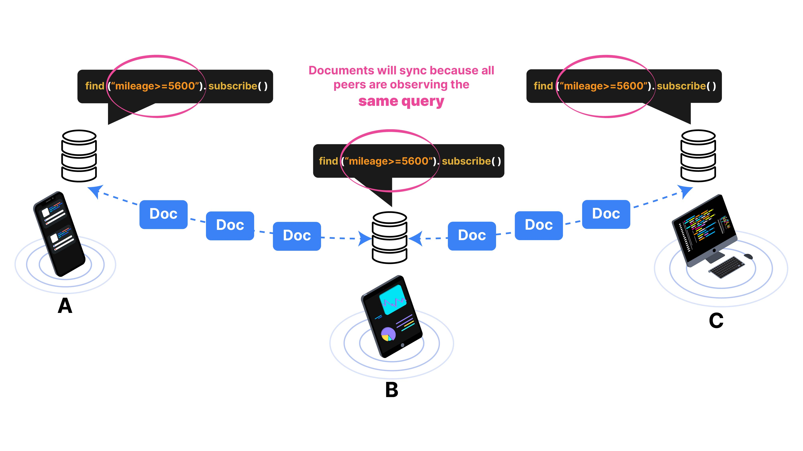

import Tabs from '@theme/Tabs';
import TabItem from '@theme/TabItem';
import SnippetGroup from '@site/src/components/SnippetGroup';

## How Does Ditto Sync Data?
In this narrated video, take a glimpse under the hood of Ditto's unique sync process. This video will 
explain how Ditto utilizes multiple transports at once to efficiently sync data with or even without the 
internet, as well as the strengths and limitations of each transport that come together to form what we call the **Rainbow Connection**. 

<div className="iframe-container" align="center">
  <iframe 
    className="responsive-iframe"
    width="560" 
    height="315" 
    src="https://www.youtube.com/embed/8_A1CkYfzoM" 
    title="YouTube video player" 
    frameborder="0" 
    allow="accelerometer; autoplay; clipboard-write; encrypted-media; gyroscope; picture-in-picture" 
    allowfullscreen>
  </iframe>
</div>

By default, Ditto will not sync data with other devices.  When the device is
observing a query, it requests to synchronize data that matches the query from
other devices in the mesh network. 

In other words, when a live query is created, Ditto's sync system
**pulls** data from other devices. There is no way to "push" data through the
API explicitly. Devices select data they are interested in through the query
system and then synchronize with the mesh network based on that query.


## Multi-hop replication

Given that Ditto works peer-to-peer, devices can form into arbitrary groups
based on the proximity to one another, or rather they create an ad-hoc mesh
network. Ditto's sync system allows for devices to share data through another
device, called "multi-hop" sync. The only requirement for this to occur is that
all devices in the chain must be observing the same data, as shown below:



## Sync

The small peer uses a selfish, query-based synchronization protocol. That means
each device needs to explicitly tell other peers what data to sync using a query. Each peer also must explicitly opt-in to
start synchronizing data. 

Preferably, you should tell ditto to start synchronizing early on in your application's life cycle like in your `AppDelegate.application(_:didFinishLaunchingWithOptions:)` or `Application.onCreate` method. Your application only needs to call this function once.

<SnippetGroup
  name='sync-basic' 
/>


### Subscribe

Creating a subscription acts as a signal to other peers that you are interested in
receiving updates when local or remote changes are made to
documents that match the given query. 

The returned Subscription object must be kept in scope for as long as
you want to keep receiving updates. This function is useful if you're 
interested in subscribing to changes on a query to have a local offline copy of
the data.

<SnippetGroup name="subscribe" />

* Call `.subscribe` after `ditto.startSync()` to synchronize and download real-time data from other peers.
* To stop the `subscription`, call `subscription.cancel()`.

### Observe

Create a query to get notified when the database gets new changes. The returned
LiveQuery object must be kept in scope for as long as you want to keep receiving
updates. [Learn more about how to create queries](./querying)

<SnippetGroup name="sync-observe-local" />

* Call `.observeLocal` to observe real-time data from your local database.
* The callback will immediately run for documents that fit the query.
* The callback will get called with all local changes that fit the query. 
* The callback will get called for each sync or write transaction.

### LiveQueryEvent

:::info 
Reactive frameworks like React, Jetpack Compose, and SwiftUI are designed to
make UI development more efficient and help programmers build responsive
applications with minimal effort. They achieve this by abstracting the process
of updating the UI and providing optimized solutions for managing state and
rendering components. This eliminates the need for programmers to manually
implement a diffing algorithm. 
:::


If you are not using a reactive framework such as React, Jetpack Compose, or SwiftUI, you might
benefit from reacting to changes from Ditto's `LiveQueryEvent` object. A LiveQuery
callback has two arguments: `docs` and `event`. The `event` argument allows you
to identify which documents have changed in the database. There are two types of
events:

* `Initial`: The first event that will be delivered and it will only be delivered once.
* `Update`: This event will be delivered each time the results of the provided query change. It contains information about the set of documents that previously matched the query before the update, along with information about what documents have been inserted, deleted, updated, or moved, as part of the set of matching documents.

For more information, see `LiveQueryEvent` in the Ditto API reference for your language.

### Sync only relevant documents

To reduce memory and disk usage over time, *ONLY* sync documents that are relevant for a given device at a
given time. There are various approaches to this problem, and it depends on your application.

For example, if you are building a meal ordering application, you may want to
only synchronize all orders that have been created in the past 24 hours. 

```swift
ditto.store.collection("orders").find("createdAt > $args.yesterday", args: [
  "yesterday": Date().adding(hr:-24),
]).observeLocal({ cars, event in
     // do something
})
```

If there are 2,000 orders per day, you would see 2,000 documents
locally on the device. If each document is 50Kb, the device could 
replicate up to ~100 megabytes to the local database. 


## How can I subscribe to multiple queries?

Option A. Store them as multiple properties on a managed object that is kept in
scope. If the subscription falls out of scope, it will become garbage collected and sync will stop.

```swift
var subscribeA: DittoSubscription? = nil
var subscribeB: DittoSubscription? = nil

var liveQueryA: DittoLiveQuery? = nil
var liveQueryB: DittoLiveQuery? = nil
```

Option B: You could also store these objects as arrays. 

```swift
var subscriptions = [DittoSubscription]()
var liveQueries = [DittoLiveQuery]()
```

## How can I stop to subscribing data?

Ensure that you always `cancel` or `stop` on subscriptions when you no longer
wish to subscribe to a query.

```swift
// subscription = nil // this does not work
sub.cancel() // this is correct!
```

```swift
// subscriptions.removeAll() Do not do this <- this will not work

for sub in subscriptions {
   sub.cancel()
}

subscriptions.removeAll() // After calling cancel, it is safe to remove them from the array.
```


## Eviction

When you subscribe to data that is relevant, you need to remove it from the
local device once it is no longer relevant. You want to remove data from the
local database _without_ deleting that data on other devices. This operation is different than remove in that it only removes one or more
documents from the local storage and **does not sync the change to other
devices.**

You need to stop subscriptions before calling `evict()` because even if you
reset the data in a device, the data will come back immediately if the
subscription is alive. We recommend that you evict data once per day or once per
week.

<SnippetGroup
  name='evict' 
/>

### How can I remove data?

Consider using a "soft-delete" pattern in your application. You should use a
field like `isDeleted: true` instead of calling `remove()`, and then evict that data. You can query and
synchronize only the documents that not been marked archived. Using a
soft-delete pattern, documents can be synced or updated again if necessary. 

```swift
struct Note {
	let _id: String
	var text: String
	var isDeleted: Bool
}

// deleting data
note.deleted = true

// evicting old data once a week
collection.find("isDeleted == true").evict()
```


## Examples

### 1: Time-based syncing

One common design pattern is to only synchronize data that was written within the
past 24 hours. At the end of that 24 hours, documents older than 24 hours are evicted and a
new query is created.

Let's look through a typical example for syncing data: four flight attendants walk
through an airlane and record passenger meal orders on their tablets. 

The database has a `flights` collection, with each flight represented as a
document. Each document has a `createdAt` timestamp.

```json
{
  "createdAt": "2022-09-17T20:00:46.945Z",
  "flightNo": "DIT101",
  "orders": {
    "abcdef123": {
      ...
    }
  }
}
```

We want to only store data on the device that was created in the past 24 hours.
Anything older than 24 hours should be removed locally from the device. However,
we don't want to remove this data from the entire mesh network, because we may
want to do analytics on it later using the Big Peer. So, we do not use remove()
because that deletes data from the entire network, including the Cloud. We use
`evict()` to remove data from the local device because the data is not relevant
anymore.

```swift
ditto.store.collection("flights").find("createdAt <= $args.yesterday", args: [
  "yesterday": yesterday(),
]).evict()
```

One way to implement eviction would be to create a global interval. For example,
every 24 hours check to see if there is any data on the local machine that is
irrelevant. If so, evict it.

Whenever you have an eviction query that changes over time it is important that
you also properly stop your subscription and update it with a new query each time your
eviction query changes. This is because if you try to evict data that you are also subscribed to, then
after you evict the data you will immediately sync it back to the device since the
subscription is still syncing that data.

Using the example of evicting data every 24 hours we will see how to stop the subscription, evict the data,
and then start the new subscription.

```swift
// 24 hours pass. Need to evict irrelevant data.

// 1. Stop subscription
subscription.cancel()

// 2. Evict irrelevant data
ditto.store.collection("flights").find("createdAt <= $args.yesterday", args: [
  "yesterday": yesterday(),
]).evict()

// 3. Start new subscription
subscription = ditto.store.collection("flights").find("createdAt > $args.yesterday", args: [
                 "yesterday": yesterday(),
               ]).subscribe()
```

Notice that the query for eviction is exactly the opposite as the query for subscription. These
queries should not overlap, so you must stop your subscription before you evict.
Your subscription variable should remain in scope throughout the runtime time of the app, so that
it will continue to sync data and not be garbage collected.


### 2. Stateful syncing

Another common design pattern is to build state into each document type. In an
ordering application, orders go through a lifecycle.

OPEN -> IN PROGRESS -> COMPLETE -> FILLED  
|
-> CANCELLED

When the application starts, the device only wants to synchronize orders that are not
filled or cancelled, and evict any orders that have been completed.

```swift
self.query =  self.ditto.collection("orders")
  .find("status != 'FILLED' && status != 'CANCELLED'")
  .subscribe()
self.ditto.collection("orders").find("status == 'FILLED' || status == 'CANCELLED'").evict()
```

Once an order has been completed, document as “FILLED”. Live queries will fire and update the front-page.

```swift
self.ditto.collection("orders").upsert([
  "_id": id,
  "status": "FILLED"
])
```

An order could also become cancelled while it was unfilled. A cancelled order is
based on the business logic -- for example, an order could be cancelled
manually, or cancelled when the store closes, or because the order was placed
more than 24 hours prior. 

```swift
self.ditto.collection("orders").upsert([
  "_id": id,
  "status": "CANCELLED"
])
self.ditto.collection("orders").findByID(id).evict()
```
