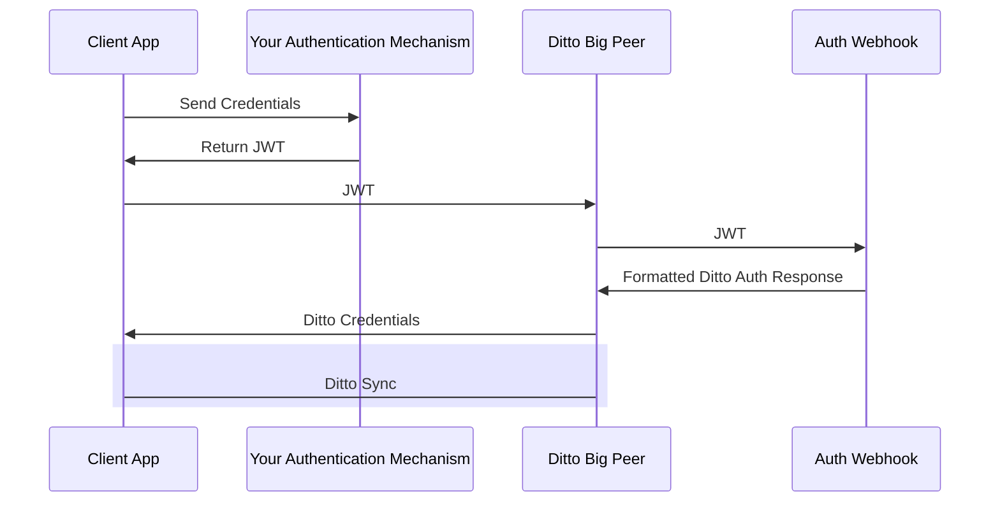

import Tabs from '@theme/Tabs';
import TabItem from '@theme/TabItem';

Ditto __does not come with an identity provider__. Using "Online With Authentication" requires that that you have your own identity provider already set up. Each app can use multiple identity providers. Identity providers can be:

The "Online With Authentication" identity type is geared towards apps that will be deployed in real world settings. "Online With Authentication" identity types are: 

* for apps that need to integrate with existing permissions
* for apps that need to integrate with existing authentication systems

## How it works

:::caution
Devices using Online with Authentication need to connect to the Internet and
authenticate at least once before synchronizing with other peers. This is
required so devices can get a valid certificate before going offline.  
:::

To use the "Online With Authentication" system, your client application is expected to authenticate with your identity system and retrieve some sort of token _prior_ to syncing with Ditto. Often times this token is some sort of identity token, access token, commonly in the format of a JWT (JSON Web Token).


Once your client application successfully has retrieved this token, it should pass it to the Ditto `authenticator` which will pass it to an authentication webhook. As the developer, you are responsible for writing code and deploying the this webhook to an accessible URL. The authentication webhook will validate and decode the token from the client side and return identity and access control information back to your Ditto instance. 

The full flow is detailed in the diagram below:



## API

### Creating your client

Create the ditto client with the `onlineWithAuthentication` identity. This
identity requires an authentication handler `authHandler`.

:::warning
You must refresh the auth token when it expires. You can do that by implementing
`authenticationExpiringSoon`. If you do not implement this, then sync will stop when the token
expires. 
:::

<Tabs
  groupId="programming-language"
  defaultValue="javascript"
  values={[
    {label: 'JavaScript', value: 'javascript'},
    {label: 'Swift', value: 'swift'},
    {label: 'Objective-C', value: 'objc'},
    {label: 'Kotlin', value: 'kotlin'},
    {label: 'Java', value: 'java'},
    {label: 'C#', value: 'csharp'},
    {label: 'C++', value: 'cpp'},
    {label: 'Rust', value: 'rust'},
  ]
}>
<TabItem value="javascript">

```js
import { init, Ditto } from "@dittolive/ditto"
(async () => {
  await init() // you need to call this at least once before using any of the Ditto API

  const authHandler = {
    authenticationRequired: async function(authenticator) {
      console.log("Login request.");
    },
    authenticationExpiringSoon: function(authenticator, secondsRemaining) {
      console.log(`Auth token expiring in ${secondsRemaining} seconds`)
    }
  }

  const identity = {
    type: 'onlineWithAuthentication',
    appID: 'REPLACE_ME_WITH_YOUR_APP_ID',
    authHandler
  }

  const ditto = new Ditto(identity, '/persistence/file/path')
  ditto.startSync()
})()
```

</TabItem>
<TabItem value="swift">

```swift
struct AuthDelegate: DittoAuthenticationDelegate {
    func authenticationRequired(authenticator: DittoAuthenticator) {
        print("Login request.")
    }

    func authenticationExpiringSoon(authenticator: DittoAuthenticator, secondsRemaining: Int64) {
        print("Auth token expiring in \(secondsRemaining)")
    }
}

let identity = DittoIdentity.onlineWithAuthentication(
    appID: "REPLACE_ME_WITH_YOUR_APP_ID",
    authenticationDelegate: AuthDelegate()
)

let ditto = Ditto(identity: identity)
try! ditto.startSync()
```

</TabItem>
<TabItem value="objc">

```objc
@interface AuthDelegate : NSObject <DITAuthenticationDelegate>
@end

@implementation AuthDelegate
- (void)authenticationRequired:(nonnull DITAuthenticator *)authenticator {
      NSLog(@"Login request.");
}

- (void)authenticationExpiringSoon:(nonnull DITAuthenticator *)authenticator
                  secondsRemaining:(int64_t)secondsRemaining {
    NSLog(@"Auth token expiring in %lld seconds", secondsRemaining);
}
@end

DITIdentity *identity = [[DITIdentity alloc] initOnlineWithAuthenticationWithAppID:@"REPLACE_ME_WITH_YOUR_APP_ID"
                                                            authenticationDelegate:[[AuthDelegate alloc] init];
DITDitto *ditto = [[DITDitto alloc] initWithIdentity:identity];
NSError *error = nil;
[ditto startSync:&error];
```

</TabItem>
<TabItem value="kotlin">

```kotlin
class AuthCallback: DittoAuthenticationCallback {
    override fun authenticationRequired(authenticator: DittoAuthenticator) {
        println("Login request.")
    }

    override fun authenticationExpiringSoon(
        authenticator: DittoAuthenticator,
        secondsRemaining: Long
    ) {
        println("Auth token expiring in $secondsRemaining seconds")
    }
}

val androidDependencies = AndroidDittoDependencies(context)
val identity = DittoIdentity.OnlineWithAuthentication(
    androidDependencies,
    "REPLACE_ME_WITH_YOUR_APP_ID",
    AuthCallback()
)
val ditto = Ditto(androidDependencies, identity)
try {
  ditto.startSync()
} catch(e: DittoError) {
  Log.e("Ditto error", e.message!!)
}
```

</TabItem>
<TabItem value="java">

```java

class AuthCallback implements DittoAuthenticationCallback {
    @Override
    public void authenticationRequired(@NonNull DittoAuthenticator authenticator) {
        System.out.println("Login request.");
    }

    @Override
    public void authenticationExpiringSoon(@NonNull DittoAuthenticator authenticator, long secondsRemaining) {
        System.out.println("Auth token expiring in " + secondsRemaining + " seconds");
    }
}

DittoDependencies androidDependencies = new DefaultAndroidDittoDependencies(this.context);
DittoIdentity identity = new DittoIdentity.OnlineWithAuthentication(
    customDirDependencies,
    "REPLACE_ME_WITH_YOUR_APP_ID",
    new AuthCallback()
);
Ditto ditto = new Ditto(androidDependencies);

try {
  ditto.startSync();
} catch(DittoError e) {
  Log.e("Ditto Error", e.getMessage())
}
```

</TabItem>
<TabItem value="csharp">

```csharp
class AuthDelegate : IDittoAuthenticationDelegate
{
    public async void AuthenticationRequired(DittoAuthenticator authenticator)
    {
        System.Console.WriteLine($"Login request");
    }

    public async void AuthenticationExpiringSoon(DittoAuthenticator authenticator, long secondsRemaining)
    {
        System.Console.WriteLine($"Auth token expiring in {secondsRemaining} seconds");
    }
}

var identity = DittoIdentity.OnlineWithAuthentication(
    "REPLACE_ME_WITH_YOUR_APP_ID",
    new AuthDelegate());

try
{
    var ditto = new Ditto(identity);
    ditto.StartSync();
}
catch (DittoException ex)
{
    System.Console.WriteLine($"Ditto Error {ex.Message}");
}
```

</TabItem>
<TabItem value="cpp">

```cpp
class AuthCallback: public AuthenticationCallback {
public:
  void authentication_required(std::shared_ptr<Authenticator> authenticator) {
      std::cout << "Login request" << std::endl;
  }

  void authentication_expiring_soon(std::shared_ptr<Authenticator> authenticator,
                                    std::int64_t seconds_remaining) {
    std::cout << "Auth token expiring in " << seconds_remaining << " seconds" << std::endl;
  }
};

Identity identity = Identity::OnlineWithAuthentication(
  "REPLACE_ME_WITH_YOUR_APP_ID",
  std::make_shared<AuthCallback>()
);
try {
  Ditto ditto = Ditto(identity, "/your-persistence-path");
  ditto.try_start_sync();
} catch (const DittoError &err) {
  std::cout << err.what() << std::endl;
}
```

</TabItem>

<TabItem value="rust">

```rust
use dittolive_ditto::prelude::*;
use std::sync::Arc;
use std::time::Duration;

struct AuthHandler {
    token: String,
    provider: String,
}

impl DittoAuthenticationEventHandler for AuthHandler {
    fn authentication_required(&self, auth: dittolive_ditto::auth::DittoAuthenticator) {
        ::log::info!("Login request.");
    }

    fn authentication_expiring_soon(
        &self,
        _auth: dittolive_ditto::auth::DittoAuthenticator,
        seconds_remaining: std::time::Duration,
    ) {
        ::log::info!(
            "Auth token expiring in {} seconds",
            seconds_remaining.as_secs()
        );
    }
}

impl Default for AuthHandler {
    fn default() -> Self {
        AuthHandler {
            token: ThirdPartyAuth::get_token(),
            provider: String::from("my-auth"),
        }
    }
}

let mut ditto = Ditto::builder()
    // creates a `ditto_data` folder in the directory containing the executing process
    .with_root(Arc::new(PersistentRoot::current_exe()?))
    .with_identity(|ditto_root| {
      // Provided as an env var, may also be provided as hardcoded string
      let app_id = AppId::from_env("DITTO_APP_ID")?;
      let auth_event_handler = AuthHandler::default();
      let enable_cloud_sync = true;
      let custom_auth_url = None;
      // return the Result<Identity, _> at the end of this closure
      OnlineWithAuthentication::new(
          ditto_root,
          app_id,
          auth_event_handler,
          enable_cloud_sync,
          custom_auth_url,
      )
    })
    .with_transport_config(|_identity| {
        let mut config = TransportConfig::enable_all_peer_to_peer()
    })
    .build()?;

ditto.try_start_sync()?;
```

</TabItem>
</Tabs>

### Login

Login takes two parameters: the first is `token`. The token can be any string
value. Most auth services use a [JWT (JSON Web Token)](https://jwt.io/), but you
can send any token you want from the client.  For example, during testing you
may want to create a secret code for development
use. This string will be sent in a POST request to the HTTP route.


<Tabs
  groupId="programming-language"
  defaultValue="javascript"
  values={[
    {label: 'JavaScript', value: 'javascript'},
    {label: 'Swift', value: 'swift'},
    {label: 'Objective-C', value: 'objc'},
    {label: 'Kotlin', value: 'kotlin'},
    {label: 'Java', value: 'java'},
    {label: 'C#', value: 'csharp'},
    {label: 'C++', value: 'cpp'},
    {label: 'Rust', value: 'rust'}
  ]
}>
<TabItem value="javascript">

```js
let accessToken = await ThirdPartyAuth.getToken()
await ditto.auth.loginWithToken(accessToken, 'my-auth')
```

</TabItem>
<TabItem value="swift">

```swift
ditto.auth.loginWithToken(ThirdPartyAuth.getToken(), provider: "my-auth") { err in
    print("Login request completed. Error? \(err)")
}
```

</TabItem>
<TabItem value="objc">

```objc
[ditto auth loginWithToken:[ThirdPartyAuth getToken] provider:@"my-auth" completion:^(NSError * _Nullable err) {
    NSLog(@"Login request completed. Error? %@", err);
}];
```

</TabItem>
<TabItem value="kotlin">

```kotlin
ditto.auth.loginWithToken(ThirdPartyAuth.getToken(), "my-auth") { err ->
    println("Login request completed. Error? $err")
}
```

</TabItem>
<TabItem value="java">

```java
ditto.auth.loginWithToken(credentials.accessToken, "my-auth", err -> {
    System.out.println("Login request completed. Error? " + err.toString());
});
```

</TabItem>
<TabItem value="csharp">

```csharp
var res = await authenticator.LoginWithToken(ThirdPartyAuth.GetToken(), "my-auth");
System.Console.WriteLine($"Login request completed. Error? {res}");
```

</TabItem>
<TabItem value="cpp">

```cpp
authenticator->login_with_token("123", "my-auth", [](std::unique_ptr<DittoError> err) {
  std::cout << "Login request completed. Error?" << err->what() << std::endl;
});
```

</TabItem>
<TabItem value="rust">

  ```rust
  auth.login_with_token(&self.token, &self.provider) {
      ::log::info!("Login request completed. Error? {:?}", &e);
  }
  ```

</TabItem>
<TabItem value="http">

  ```bash
  curl -X DELETE 'https://{app_id}.cloud.ditto.live/api/v1/collections/people/documents/<doc_id>' \
    --header 'X-DITTO-CLIENT-ID: AAAAAAAAAAAAAAAAAAAABQ==' \
    --header 'Content-Type: application/json' 
  ```

</TabItem>
</Tabs>

### Logout

Logout will stop sync, shut down all replication sessions, and remove any cached
authentication credentials. Note that this does not remove any data from the
store. If you wish to delete data from the store then use the optional
`cleanupFn` parameter to perform any required cleanup.

The `cleanupFn` is an optional function that will be called with the relevant Ditto
instance as the sole argument that allows you to perform any required cleanup of
the store as part of the logout process.


<Tabs
  groupId="programming-language"
  defaultValue="javascript"
  values={[
    {label: 'JavaScript', value: 'javascript'},
    {label: 'Swift', value: 'swift'},
    {label: 'Objective-C', value: 'objc'},
    {label: 'Kotlin', value: 'kotlin'},
    {label: 'Java', value: 'java'},
    {label: 'C#', value: 'csharp'},
    {label: 'C++', value: 'cpp'},
    {label: 'Rust', value: 'rust'}
  ]
}>
<TabItem value="javascript">

```js
async function cleanupFn (ditto) {
  await ditto.store.collection('cars').findAll().evict()
}
await ditto.auth.logout(cleanupFn)
```

</TabItem>
<TabItem value="swift">

```swift
ditto.auth.logout(cleanup: { ditto in
    ditto.store.collection("cars").findAll().evict()
})
```

</TabItem>
<TabItem value="objc">

```objc
[ditto.auth logout:^(DITDitto *ditto) {
  DITCollection *collection = [ditto.store collection:@"cars"];
  [[collection findAll] evict];
}];
```

</TabItem>
<TabItem value="kotlin">

```kotlin
ditto.auth.logout {
  ditto.store["cars"].findAll().evict()
}
```

</TabItem>
<TabItem value="java">

```java
 ditto.auth.logout(ditto -> {
  ditto.store.collection("cars").findAll().evict();
 })
```

</TabItem>
<TabItem value="csharp">

```csharp
ditto.Auth.Logout((Ditto ditto) =>
{
  ditto.Store.Collection("cars").FindAll().evict();
});
```

</TabItem>
<TabItem value="cpp">

```cpp
ditto.auth.logout({
  ditto.store.collection("cars").findAll().evict();
})
```

</TabItem>
<TabItem value="rust">

```rust
ditto.auth.logout(|ditto| {
  ditto.store().collection("cars")?.find_all().evict()?;
});
```

</TabItem>
</Tabs>

## Tutorial


* __This section will require knowledge of writing server side HTTP endpoints and handlers.__ The server side sample code is written in JavaScript (NodeJS with an [Express](https://expressjs.com/)-like API), however you can use any framework or language of your choosing.

* __We will use Auth0 in this tutorial.__ But you can use any third-party identity provider. Each app can use multiple identity providers. Identity providers can be: 

* In this tutorial, you'll build a simple application so users can log in with a
a third-party provider using [Auth0](https://auth0.com/). We assume that you
have already completed the Auth0 tutorial on their documentation before starting
this tutorial. 

* For the full application code in JavaScript and Swift, see the [code samples on
GitHub](https://github.com/getditto/samples/tree/master/authentication).


### Server 

The authentication webhook needs to handle an __HTTP POST__ request. Each client
that will need to authenticate will send a payload to this webhook. The
following section requires that you have knowledge of writing server side HTTP
endpoints and responding with a JSON payload. Code samples of server side code
are written with a NodeJS / Express syntax. You can use any language or
framework on the server side. 

#### Incoming POST body

When your client device wants to authenticate using your webhook, your server will
receive an HTTP post with a JSON payload that looks like:

```jsonc 
{
  "appID": "YOUR_APP_ID_HERE", // the appID
  "provider": "my-auth", // this is the "Name" of the "Authentication Webhook"
  "token": "eyJhbGciOiJI..." // this is what each device will send to authenticate
}
```

Your can introspect these values by parsing out the request body:

```js
let express = require('express')
let cors = require('cors')
let body = require('body-parser')
let app = express()

app.use(cors())
app.use(body.json())

let app = express()

app.post('/', (req, res) => {
  const appID = req.body.appID
  const provider = req.body.provider
  const token = req.body.token
})
```

Generally, you will want to check the token for some sort of validity. Let's
assume you have some sort of library or logic to parse and validate the token is
for a specific user. 

You can also use the `userInfo` key in your JSON response to
pass information back to client.

```js
app.post('/', async (req, res) => {
  const token = req.body.token;
  try {
    // The token that your server receives from ditto is always a string
    let parsedToken = JSON.parse(token)
    let payload = getDittoPermissions(parsedToken)
    res.json(payload)
  } catch (err) {
    res.json({
      "authenticate": err,
      "userInfo": err.message
    }) 
  }
})
```

As a simple example, let's grant full `read` & `write` permissions to _all
collections_ and _all documents_. 

```js
app.post('/', async (req, res) => {
  const token = req.body.token;
  try {
    let payload = {
      "authenticate": true,
      "expirationSeconds": 28800,
      "userID": "123abc",
      "permissions": {
        "read": {
          "everything": true,
          "queriesByCollection": {}
        },
        "write": {
          "everything": true,
          "queriesByCollection": {}
        }
      }
    }
    res.json(payload)
  } catch (err) {
    res.json({
      "authenticate": err,
      "userInfo": err.message
    }) 
  }
})

```

For more information on how to design your app's permissions, see [Access Control
Permissions](./designing-permissions).

#### Deploy your server

Now, the portal will attempt to reach this server. That means you must deploy it
somewhere that this HTTP request is accessible. For testing, you
can use a quick-deploy service such as [Glitch](https://glitch.com/).

:::info
Please be sure that this endpoint is not behind a firewall or VPN.  If you
cannot get around this requirement [contact us](mailto:support@ditto.live). 
:::

```js
app.listen(process.env.PORT, () => {
  console.log('server listening on ', process.env.PORT)
})
```

#### Configure your Portal App

To use an "Online With Authentication" identity, go to your app in the [portal](https://portal.ditto.live/) and find the __Authentication Mode & Webhook Settings__ section. Ensure that __"With Authentication"__ is selected like so:


Below, a section called __Authentication Webhooks__ will be editable. Once your Authentication Webhook Endpoint(s) is deployed and ready, you can register it in the portal. Add a __Name__ and __URL__. 

* The __Name__ is used the differentiate between multiple authentication. Most applications will have one authentication webhook, however the __Name__ parameter is still required. This name value is important for the next section.
* The __URL__ parameter is the fully qualified URL of the webhook that you deployed in the section above. Please include the protocol (_https:// or http://_ though we highly discourage
_http://_).


### Client 

To configure your client application, you must first add URL of the POST
endpoint you created in the previous section.


:::info
The provider name given to the Ditto Client must match a provider name in the Portal (e.g., `my-auth`).
:::

This tutorial assumes you've already configured your `auth0` client from the
official [Auth0 documentation](https://auth0.com/docs/).

#### Login

<Tabs
  groupId="programming-language"
  defaultValue="javascript"
  values={[
    {label: 'JavaScript', value: 'javascript'},
    {label: 'Swift', value: 'swift'},
    {label: 'Kotlin', value: 'kotlin'}
  ]
}>
<TabItem value="javascript">

Assuming you have a login button in the HTML:

```html
<button onClick={login}>Login</button>
```

We attach a `login` function to the button.

```js
import createAuth0Client from '@auth0/auth0-spa-js';
// OR for React
import { useAuth0 } from '@auth0/auth0-react';

// configure your auth0 client...

async function login () {
  await auth0.loginWithRedirect({
    redirect_uri: window.location.origin
  });
  startDitto()
}
```


We can then create a `startDitto` function that gets the access token and starts a
new Ditto instance, and passes the token to your server route you created in the previous section.

```js
import createAuth0Client from '@auth0/auth0-spa-js';
// OR for React
import { useAuth0 } from '@auth0/auth0-react';
import { init, Ditto } from "@dittolive/ditto"

// configure your auth0 client...

let ditto

(async () => {
  await init() // you need to call this at least once before using any of the Ditto API

  function startDitto () {
    let token = await auth0.getAccessTokenSilently();

    const authHandler = {
      authenticationRequired: async function(authenticator) {
        await authenticator.loginWithToken(token, "my-auth");
        console.log("Login request completed.");
      },
      authenticationExpiringSoon: function(authenticator, secondsRemaining) {
        console.log(`Auth token expiring in ${secondsRemaining} seconds`)
        await authenticator.loginWithToken(token, "my-auth");
        console.log("Login request completed.");
      }
    }

    const identity = {
      type: 'onlineWithAuthentication',
      appID: 'REPLACE_ME_WITH_YOUR_APP_ID',
      authHandler
    }

    ditto = new Ditto(identity, '/persistence/file/path')
    ditto.startSync()
  }

  async function login () {
    await auth0.loginWithRedirect({
      redirect_uri: window.location.origin
    });
    startDitto()
  }
})()
```

To demonstrate that this Ditto client has been authenticated, let's display the
number of cars in the collection, and a button to add one item to it: 

```html
<div>
  <h1>Cars: {numberOfCars}</h1>
  <button onClick={addItem}>+1</button>
</div>
```

Once we start the ditto instance, we can create a `liveQuery` and create a
button that adds items to a collection:

```js
let subscription = ditto.store.collection('cars').find("state == 'FOR_SALE'").subscribe()
let liveQuery = ditto.store.collection('cars').find("name == 'Toyota'").observeLocal((cars) => {
  numberOfCars = cars.length
})

function addItem () {
  ditto.store.collection('cars').upsert({
    "name": 'Toyota',
    "state": 'FOR_SALE'
  })
}
```

</TabItem>
<TabItem value="swift">

Assuming you have a login button in your SwiftUI ContentView, we want to create
a new `ObservedObject` that we can subscribe to for updates to the
authentication status.

```swift
class ProfileViewModel: ObservableObject {
  // your authentication code will go here
}

struct ContentView: View {
    @ObservedObject var viewModel: ProfileViewModel = ProfileViewModel()

    var body: some View {
      Button("Login").padding()
    }
}
```

We attach a login function to the button

```swift
class ProfileViewModel: ObservableObject {
  // highlight-start
  let credentialsManager = CredentialsManager(authentication: Auth0.authentication())

  func login () {
      Auth0
          .webAuth()
          .scope("openid profile")
          .audience("https://ENTER_YOUR_SCOPE_URL_HERE.auth0.com/userinfo")
          .start { result in
              switch result {
              case .success(let credentials):
                  print("Obtained credentials: \(credentials)")
                  self.credentialsManager.store(credentials: credentials)
                  self.startDitto()
              case .failure(let error):
                  print("Failed with: \(error)")
                  // Handle Error
              }
          }
  }
  // highlight-end
}

struct ContentView: View {
    @ObservedObject var viewModel: ProfileViewModel = ProfileViewModel()

    var body: some View {
      Button("Login", action: viewModel.login).padding()
    }
}
```

We can then create a startDitto function that:

1. Gets the access token from Auth0;
2. Starts the Ditto instance; and 
3. Creates a liveQuery


```swift
class ProfileViewModel: ObservableObject {
  // highlight-next-line
    @Published var ditto: Ditto?
  // highlight-next-line
    @Published var docs: [DittoDocument] = []
    ....

    func startDitto () {
      // 1. Get the access token from Auth0
      // highlight-start
        credentialsManager.credentials { error, credentials in
            guard error == nil, let credentials = credentials else {
                // Handle error
                return
            }
            
            guard let accessToken = credentials.accessToken else {
                // Handle Error
                return
            }
            self.authDelegate = AuthDelegate(token: accessToken)
          // highlight-end
        
            // 2. Start the Ditto instance 
            // highlight-start
            let identity = DittoIdentity.onlineWithAuthentication(
                appID: "YOUR_APP_ID_HERE",
                authenticationDelegate: self.authDelegate
            )

            let ditto = Ditto(identity: identity)
            try! ditto.startSync()
            // highlight-end

            // 3. Create a liveQuery 
            // highlight-start
            self.ditto = ditto
            let subscription = ditto.store.collection("cars").find("state == 'FOR_SALE'").subscribe()
            let liveQuery = ditto.store.collection("cars").find("name == 'Toyota'").observeLocal { docs, event in
                self.docs = docs
            }
            // highlight-end
            
        }
    }
}
        
```

To pass the token to your server route you created in the previous section, you
need to create an `AuthDelegate` class that is passed to the Ditto constructor:

```swift
class AuthDelegate: DittoAuthenticationDelegate {
    var token: String
    
    init (token: String) {
        self.token = token
    }

    func authenticationRequired(authenticator: DittoAuthenticator) {
        authenticator.loginWithToken(self.token, provider: "my-auth") { err in
            print("Login request completed. Error? \(err)")
        }
    }

    func authenticationExpiringSoon(authenticator: DittoAuthenticator, secondsRemaining: Int64) {
        print("Auth token expiring in \(secondsRemaining)")
        authenticator.loginWithToken(self.token, provider: "my-auth") { err in
            print("Login request completed. Error? \(err)")
        }
    }
}
```

Our ContentView can now display the number of cars, and you can add a button for
adding an item to the database:

```swift

struct ContentView: View {
    @ObservedObject var viewModel: ProfileViewModel = ProfileViewModel()
    
    var body: some View {
          Button("Login", action: viewModel.login)
              .padding()
        }
    
        Text("Cars:" + String(viewModel.docs.count))
        // Bonus points: implement addItem button using Ditto's `upsert`
        Button("+1", viewModel.addItem)
        
    }
}

```

</TabItem>
   
<TabItem value="kotlin">
 // TODO

</TabItem>
</Tabs>

To make this usable for real-world applications, you can retreieve the user's
profile details such as email, username, and full name. See the official Auth0
documentation for your platform to add that functionality to your application


#### Logout 

First, we need some sort of way to monitor the state of the login flow. This
allows us to display a Logout button when the user has already logged in.

<Tabs
  groupId="programming-language"
  defaultValue="javascript"
  values={[
    {label: 'JavaScript', value: 'javascript'},
    {label: 'Swift', value: 'swift'}
  ]
}>
<TabItem value="javascript">

```js
let loggedIn = false
if (auth0.isAuthenticated()) {
  loggedIn = true
}
```
 
```html
if (loggedIn) {
  // render the logout button
  <button onClick={onLogoutClick}>Logout</button>
} else {
  <button onClick={login}>Login</button>
}
```


And then we can write the logout function and attach it to the button.

We also recommend calling `ditto.auth.logout` with a callback function that
evicts any data from the local database. 

```js
function onLogoutClick() {
  ditto.auth.logout(() => {
    ditto.store.collection('cars').findAll().evict()
  })
  await auth0.logout({ returnTo: window.location.origin })
}
```

</TabItem>
<TabItem value="swift">

``` swift
class ProfileViewModel: ObservableObject {
  //highlight-start
  @Published private(set) var state = State.isLoading

  enum State {
      case isLoading
      case loaded(UserInfo)
  }
  //highlight-end

}

struct ContentView: View {
    @ObservedObject var viewModel: ProfileViewModel = ProfileViewModel()
    
    var body: some View {
       
        switch viewModel.state {
          case .isLoading:
              Button("Login", action: viewModel.login)
          case .loaded(let user):
              Text(user.name ?? "Anonymous Ditto User")
              Button("Logout", action: viewModel.logout)
          }
    
        Text("Cars:" + String(viewModel.docs.count))
        
    }
}
```

And then we can write the logout function and attach it to the button.

We also recommend calling `ditto.auth.logout` with a callback function that
evicts any data from the local database. 

```swift
class ProfileViewModel: ObservableObject {
  ...
  
  func logout () {
      Auth0
          .webAuth()
          .clearSession(federated: false) { result in
              if result {
                  if (self.ditto != nil) {
                    // Clean up the cars collection after logout
                    // highlight-start
                      self.ditto!.auth?.logout(cleanup: { ditto in
                          ditto.store.collection("cars").findAll().evict()
                      })
                    // highlight-end
                  }
                  self.state = State.isLoading
              }
          }
  }
  
}

```
</TabItem>
</Tabs>

🎉 You now have a fully functioning `onlineWithAuthentication` app. Build and
run it on a device.

For the full application code in React and iOS, see the [code samples on GitHub](https://github.com/getditto/samples/tree/master/authentication).
