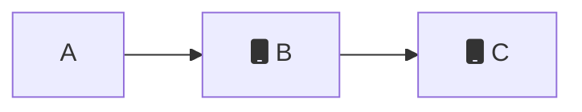
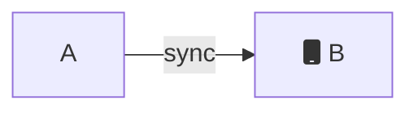

You can describe permissions attributed using a JSON
document. This JSON document is encoded within the certificate used by each
device. Each peer verifies the cerificates of other peers, and accepts or rejects reads
and writes based on these permissions.

You can issue each certificiate [manually](../how-it-works/certificate-security) or with the [Online with
Authentication identity](../security/authentication). 

## Rejecting a user

To reject a user from reading or writing at all, specify the JSON payload below.

```jsonc
{
  "authenticate": false
}
```

## Accepting a user

To grant full `read` & `write` permissions to _all collections_ and _all documents_:

```jsonc
{
  "authenticate": true,
  "expirationSeconds": 28800,
  "userID": "123abc",
  "permissions": {
    "read": {
      "everything": true,
      "queriesByCollection": {}
    },
    "write": {
      "everything": true,
      "queriesByCollection": {}
    }
  }
}
```

* `authenticate` to `true` to tell the webhook that the user has successfully validated
* `expirationSeconds` is `number` property on how long the authentication session is valid for before a refresh is required.
* `userID` is a `string` which identifies the the `userID`. This should be _unique_ across users within your app. 
* `permissions` which describes all the types of access control for collections and documents that this user can `read` or `write`

## Using the _id field

Currently, you can __only specify a permission query on the `_id` field of a
document__. Permissions on mutable properties are currently not supported. 

To grant selective permissions on specific documents, add to the
`queriesByCollection` property inside either the `read` or `write` property.
Each key inside `queriesByCollection` is a reference to the collection. Each
value is an array of [ditto queries](../concepts/querying) describing which
documents the user can read or write.

## Example

The following write permissions below describe that `userID: "123abc"` can

1. `write` to documents in the `"books"` collection where the `_id.title` value `endsWith('Potter')`.
2. `write` to any document in the `"newspapers"` collection. We use a single value of `true` 
3. `read` to documents in the `"books"` collection where the `_id.title` value `endsWith('Potter')`.

```jsonc
{
  "authenticate": true,
  "expirationSeconds": 28800,
  "userID": "123abc",
  "permissions": {
    "write": {
      "everything": false, // ensure that this is false
      "queriesByCollection": {
        // highlight-start
        // 1. 
        "books": [
          "endsWith(_id.title, 'Potter')"
        ],
        // highlight-end
        
        // highlight-start
        // 2. 
        "newspapers": [
          "true"
        ]
        // highlight-end
      }
    },
    "read": {
      "everything": false, // ensure that this is false
      "queriesByCollection": {
        // highlight-start
        // 3.
        "books": [
          "endsWith(_id.title, 'Potter')"
        ],
        // highlight-end
      }
    }
  }
}
```


## Threat modeling in P2P networks

Threat modeling is a process used by software engineers to identify, analyze,
and prioritize threats that could potentially impact an application. It helps
engineers identify potential weak points in an application and take steps to
mitigate those risks. Threat modeling involves identifying the assets that an
application needs to protect, assessing the potential threats to those assets,
and determining the best ways to protect them.

By identifying potential risks, engineers can ensure that the application is
secure from malicious actors and that users' data is protected. Threat modeling
can also help ensure that the application meets the company's security
standards and regulations. 

Threat modeling in peer-to-peer (P2P) networks is different than that in
client-server networks due to the distributed nature of the P2P network. In a
client-server network, there is a single server that all clients connect to, and
thus all of the data and resources are centralized. This makes it easier to
identify potential threats and vulnerabilities, but creates a entry that can be
targeted by an attacker, making it easier to exploit the entire network at once.

Peer-to-peer (P2P) networks are networks that do not have a central server, but
rather all nodes are equal, allowing clients to share resources with each other
directly. As such, P2P networks have more restrictive permissions on
synchronization than client-server authentication systems, as nodes are required
to agree to any changes made by other peers. This is done to ensure that no node
has an advantage over another and that all nodes remain secure.  

Therefore, even though peers in Ditto may have overlapping subscriptions, Ditto peers are only able
to syncronize data directly from a peer that has the authority to write that
document. In other words, small peers are only able to trust writes from other peers that have
the authority to make those writes. They cannot trust each other as a source of
data that they aren't authorized to write to, since they can't tell the
difference between an edit they made on their own and one which came from a
further hop.

### Read-only security model

Because Ditto peers are only ableto syncronize data directly from a peer that has the authority to write that document, a read-only security model comes with some caveats. This section covers how to best implement this security model and the trade-offs that exist in peer-to-peer networks.

Ditto provides a mechanism to specify which small peers can read documents in a collection *without permission to write*. This can be useful in situations where you have restrictive user roles, such as customer and employee. 

To implement read-only documents, you should create restrictive write permissions that include the `userId` inside of the document `_id`.  Ditto ensures that only those authorized to create documents with a particular document `_id` are able to syncronize those documents in a trustworthy manner throughout the system. 

```
{
  "authenticate": true,
  "expirationSeconds": 28800,
  "userID": "A",
  "permissions": {
    "read": {
      "everything": true,
      "queriesByCollection": {}
    },
    "write": {
      "everything": false,
      "queriesByCollection": {
        "messages": ["_id.userID == 'A'"]
      }
    }
  }
}
````

#### Read-only example 

In this example, peers can read chat messages from other people, but cannot
write to them. They can only write their own chat messages.

Imagine three peers, Peer A, B, and C. Peers A and B are connected, but Peer C only connected to peer
B. 




Every peer has similar permissions, where they can read everything but can only write to a collection with an `_id` that represents their `userID`. So, for example, Peer A has the following permissions:

```jsonc
{
  "authenticate": true,
  "expirationSeconds": 28800,
  "userID": "A",
  "permissions": {
    "read": {
      "everything": true,
      "queriesByCollection": {}
    },
    "write": {
      "everything": false,
      "queriesByCollection": {
        "messages": ["_id.userID == 'A'"]
      }
    }
  }
}
```

Peer A writes a message and syncs that message to B.

```json
{
  "_id": {
    "messageId": "00372532806762369024",
    "userID": "A"
  },
  "text": "Hello world!"
}
```




However, Peer B cannot forward that message from A to C. This is because peer B does not have write permissions to create documents with `userID=A`. 


```mermaid
graph LR;
    A[A] -->|sync| B((fa:fa-cloud Big Peer));
    B("B")-.Does not sync. B does not have write permissions for userID=A.-> C[fa:fa-mobile C];
```

Today Ditto enforces that data which has to propagate peer-to-peer must have mutual
write permissions. If integrity is at risk, you have to sign the payloads
yourself at the application level.

:::info
### Threat 
A hacker attempts to write messages *pretending to be peer A* even though they are only allowed to read. 
1. Steal mobile phone that is authorized as Peer B
2. Create documents pretending to be Peer A.  

This is a credible attack vector, especially if Peer A represents an authority
in the system, such as an administrative user. This design prevents a hacker
from impersonating Peer A, because other peers will only syncronize documents
from Peer A when they have a direct connection to Peer A, and can verify their certificate is valid.  
:::

### App-level Security

The access rules contained in the identity are rigid, signed by the central
certificate authority, and enforced by all participating devices. This offers
the highest level of security. If a device is not allowed to access particular
data, it will never be synced to their device. See [Query Overlap
Groups](../mesh-network/query-overlap-groups), for more details on multi-hopping
through untrusted devices.

For apps with weaker security requirements, a developer may choose to relax the
access rules inside the Ditto certificate, and instead restrict access in their application code.

One advantage is that the developer has more flexibility to change the access
rules dynamically since they are not encoded in signed certificates. Another
advantage is that all devices in the mesh can participate in syncing the data,
which may help it propagate faster. If certain data is only accessible to a few
privileged devices which are not often in range of each other, it will take
longer for them to sync.

The disadvantage is that an unprivileged user does have a device containing
privileged data. A technically savvy user or phone thief may be able to gain
access to not only their regular data, but also the more privileged data that
they were never intended to be able to view.

Therefore relaxed access rules - app-level security - are only suitable for
environments where there is a degree of trust that the devices won't end up
unlocked in the wrong hands.
