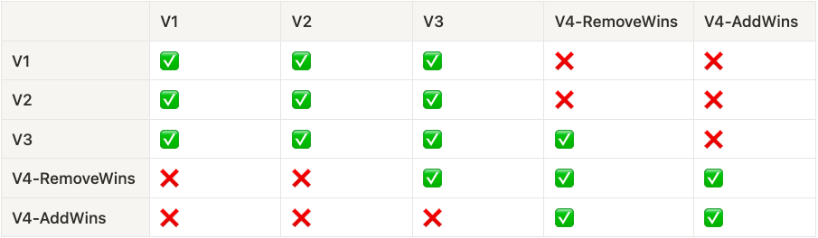

Ditto version 4 (V4) will be a significant internal database upgrade compared to past versions, with performance and design
improvements. This blog post covers the most consequential change to the CRDT that powers the database.

V4 introduces **AddWins** CRDT merge behavior to replace the existing **RemoveWins** merge behavior. This is no easy feat, as we will
explain below, but we believe this change is critical for our customers to build best-in-class experiences.

In V4, the merge logic for the `remove` operation in the CRDT will change, and the new CRDT Version 4 is incompatible with Version 2.
This is not something we take lightly, and we want to stress that we don't foresee a huge breaking change like this happening
again. We know getting all mobile users to update to the latest version of an application is challenging.

### TLDR: What do I need to do?

- If you are synchronizing with the Big Peer, update your code to version 3.0.x or 4.0.0. For the full V3 migration guide,
  visit our [docs here](https://raw.githubusercontent.com/getditto/website-2022/52937150268e86e4b5f6b64e9bb4cd7e291dbc05/pages/blog/posts/ditto-version-4-addwins-for-the-win/version_matrix.png?token=GHSAT0AAAAAABTDLIDYO3MJBSXASPLVL6OOZA3KSQA).
- If you are on a dedicated cluster, please coordinate with us on an alternative date to deploy your big peer to V3. Email
  support@ditto.live if you need more time to upgrade to V3.
- Ditto Version 4  s available for you to install today. You can use it by specifying `4.0.0` in your
  language package manager.
- When ready to use the new CRDT, update your code to v4 and call the feature flag `disableSyncWithV3()`.
  For more information, continue reading.

## Digging into the Details

### What is RemoveWins?

Ditto version 2 (V2) uses a CRDT with a **RemoveWins** merge strategy. **RemoveWins** applies when a peer (including the Big Peer)
concurrently removes a document while another peer updates the same document. In **RemoveWins**, the remove operation persists,
instead of the update operation. In other words, the concurrent update is lost.

Let&apos;s explore a **RemoveWins** example to understand why this behavior causes unexpected problems. Assume two peers have synced the same
document with the following shape at T=1 in the `products` collection:

```swift
{
  "_id": "abc123",
  "productName": "Peanuts",
  "price": 4.00
	"meta": {
    "updated_at": "2023-01-17T00:16:40.890Z"
  }
}
```

Both devices go offline, and each makes a concurrent change at the same logical timestamp T=2:

```swift
products
  .findById("abc123")
  .remove()
```

```swift
products.upsert([
  "_id": "abc123",
  "productName": "Peanuts",
  "price": 4.99
	"meta": {
    "updated_at": "2023-01-17T00:18:40.890Z"
  }
])
```

When the devices go back online and sync, they converge to the same state. With the RemoveWins merge strategy,
the `remove` call is destructive. The document with `_id="abc123"` is no longer in the collection. As a reminder,
`remove` deletes documents from the local device _and all other peers._

### The Problem with RemoveWins

There is one major problem with RemoveWins — it is nearly impossible to “undo” a remove. To “undo” the `remove` with this
CRDT, the device performing the (”undo”) upsert must observe all “deletes” to win. If it misses any of them, the upsert will lose to any of the unobserved removes eventually. In production apps, it&apos;s impossible to coordinate all devices to re-add the document at a particular time. To illustrate this problem,
remember the scenario above. If Device A is offline for some time and connects back to the network, the tombstone will become
“resurrected” — i.e., active again, and will overwrite all other changes made.

In other words, if you call `remove` on a document with a RemoveWins CRDT, your application should consider this document _gone_
_forever_ throughout your system. In the above example, a device can never create a document with the same `_id` in `products`. To
make this even more complex, this behavior also applies to the Map type inside of each document. This behavior is both
destructive and unpredictable, especially in a disconnected environment where lots of devices go in and out of connectivity.

### AddWins to the Rescue

In an **AddWins** CRDT, any device can “undo” the remove by calling `upsert` on the document with `_id=abc123` again. Essentially,
the new **AddWins** merge strategy prevents documents from being erased with no recourse once any person calls `remove`.

## How can I use AddWins?

So I know what you&apos;re thinking now. **RemoveWins** sounds like a bug field! How do I get this awesome new **AddWins** functionality?

At Ditto, customer data and the continuity of the application experience are of utmost importance to us. Because of this, we&apos;ve
dedicated immense engineering resources to ensure customers can transition from **RemoveWins** to **AddWins**.

Below we cover each migration step in detail to ensure you can successfully make this change and begin to leverage the benefits of
**AddWins**.

### Ditto Versions 1 (V1) and 2.0x (V2)

- Both use a **RemoveWins** CRDT
- Are not compatible with **AddWins**
- Can sync with Ditto V3
- Cannot sync with Ditto V4 (which introduces **AddWins**)
- Are both unsupported after January 23rd
  - Big Peer Cloud sync will stop working unless you are on a dedicated cluster and have coordinated with us on a separate support timeline
  - New bug or security fixes will not be back-ported to these versions. If you need a bug fix back-ported, you need to coordinate support
    with us as part of a contractual support agreement.
  - Offline-only license tokens, `offlinePlayground`, and `SharedKey` identities will continue to work

#### _What to do next?_

:::info
If you're on Version 1 or 2.0x, upgrade to 3.0x. For the full V3 migration guide, click [here](https://docs.ditto.live/android/common/v3).
:::

### Ditto Version 3.0x (V3)

V3 is an intermediate version that knows how to synchronize with V2 or V4 — but not both simultaneously. V3 prepares the local data store 
for the AddWins migration in V4.

#### V3 Overview

- Uses a __RemoveWins__ CRDT
- Prepares the local data store for __AddWins__
- Can sync with both V2 and V4
- Once a V3 device syncs with a V4 device, it cannot sync with a V2 device ever again
- No new bug or security fixes will be back-ported to this version after January 23, 2023

#### _What to do next?_

:::info
Ensure all devices are on Version 3.0.x then continue to the next step of upgrading to version 4. For the full V3 migration guide, click [here](https://docs.ditto.live/android/common/v3).
:::

### Ditto Version 4 (V4)

V4 can synchronize __RemoveWins__(V3) and __AddWins__ changes, but it __cannot sync__ with V2. Before you deploy the V4 SDK, 
ensure all devices on your application have been updated to V3. This is an epidemic that synchronizes to all peers with 
the same AppID.

#### V4 Overview

- Can sync with V3
- Cannot sync with V1 or V2
- Upgrading to V4 requires no code changes, it is simply a version bump from V3 to V4
- Uses a __RemoveWins__ CRDT (by default)
- You can use an __AddWins__ CRDT with flag enabled (see below)

#### _What to do next?_

:::info
Ensure all devices are on Version 4, then continue to the next step of enabling **AddWins**.
:::

### Ditto Version 4 with AddWins

V4 has a feature flag that when called will disable __RemoveWins__ and enable __AddWins__. This feature flag 
is `disableSyncWithV3()`. Once this feature flag is called, all devices in the system will transition to __AddWins__. 
Because V3 only synchronizes __RemoveWins__ changes, V4 clients will no longer be able to synchronize with V3 once this 
flag is enabled. It&apos;s important to ensure that all of your end-user devices have updated to V4 before calling the 
feature flag. 

#### Overview

- AddWins can be enabled using a feature flag `ditto.disableSyncWithV3()`
- The feature flag is partitioned by AppID
- __AddWins__ will become the default CRDT for all new apps starting in Spring 2023

#### _What to do next?_ 

:::info
Once all devices are on Version 4, enable the **AddWins** CRDT by calling `ditto.disableSyncWithV3()`.
:::

## Other Things to know

There are two parts to the migration: the local SDK, and the Big Peer. You handle the Local SDK, and we will handle the Big Peer.

### Local SDK

- You do not need to migrate any data to the local SDK database. All you need to do is update the version number, and Ditto will migrate the data for you. 
- The sync system will protect the database from incoming peers that are not compatible. 
- You should create a notification system to let your users know when to upgrade their apps so you can nudge them to upgrade to V4 of the SDK. 
- Any documents you removed in earlier versions of Ditto will still be permanently removed. For example, if you call `find("abc123").remove()` in V3, and then call `disableSyncWithV3()`, the document with `_id=abc123` will still be marked as deleted as it would in a __RemoveWins__ system. These old removes are not converted to __AddWins__.

### Big Peer

- For multi-tenant customers, Ditto SDK V2 will no longer be able to synchronize with the Big Peer after January 23, 2023.
- If you have a dedicated cluster, you can work with us on a date you would like to upgrade your Big Peer instance to support V4 with __AddWins__. 

## FAQ

__1. Can I skip a version?__

We highly recommend that customers with production scenarios do not skip versions. As outlined above V4 is not compatible with V2 and skipping V3 could result in devices that cannot sync. If you are in development mode only then you can skip from V1/V2 directly to V4.

__2. What versions are compatible?__
 - V1: Syncs with V2
 - V2: Syncs with V1 and V3
 - V3: Syncs with V1 and V2 or V4
 - V4: Syncs with V3

### Version Matrix

